Slides from Kiraly's talk at pydata global 2023 on making openly governed open source resilient.

The original video of the talk has been removed from NumFOCUS' official channel, along with other videos of pydata global 2023.

It has been [reuploaded here](https://youtu.be/IsD39KtraWI).

The views and opinions expressed in this video are solely those of the presenter.

### Slides

Title: sktime, the saga -  Trials and tribulations of a charitable, openly governed open source project

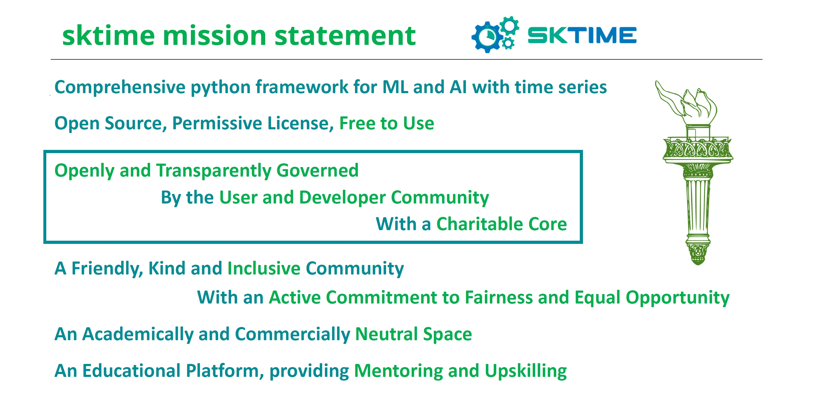

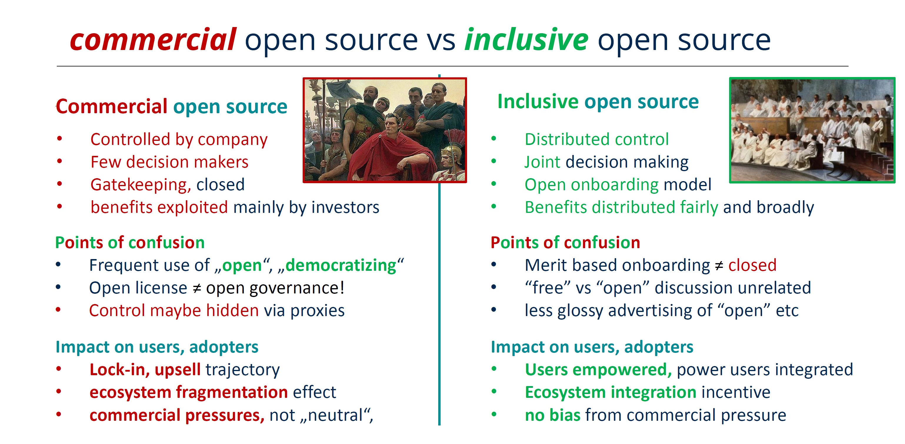

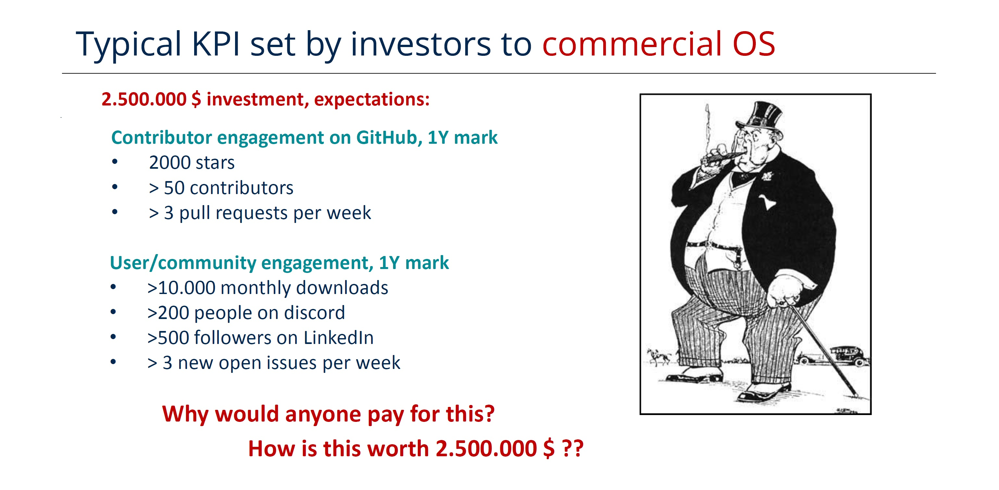

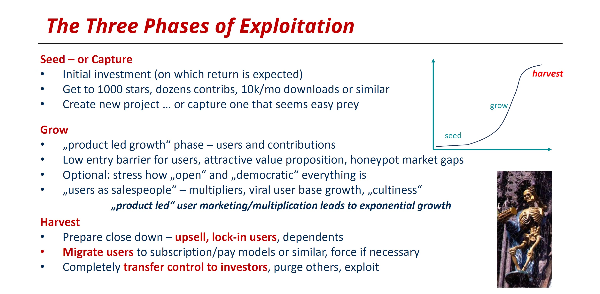

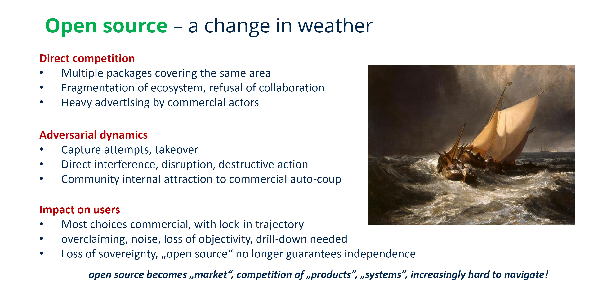

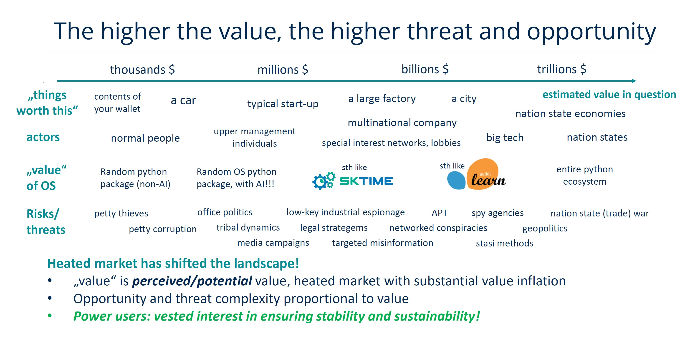

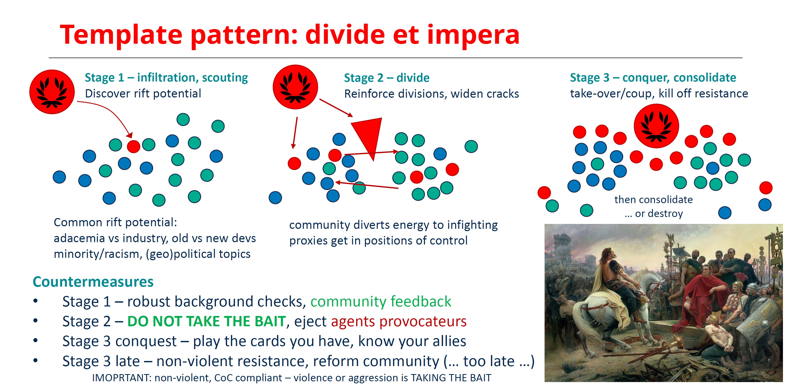

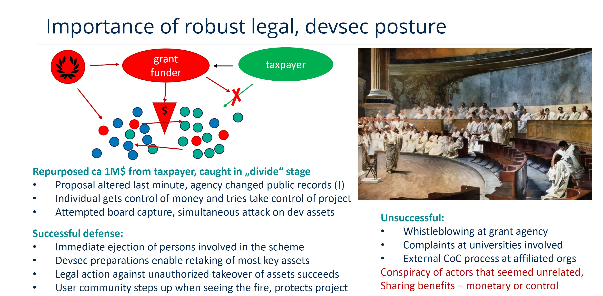

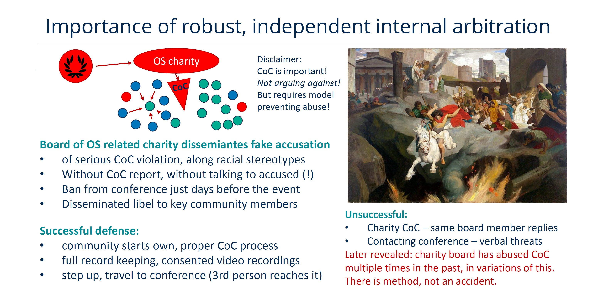

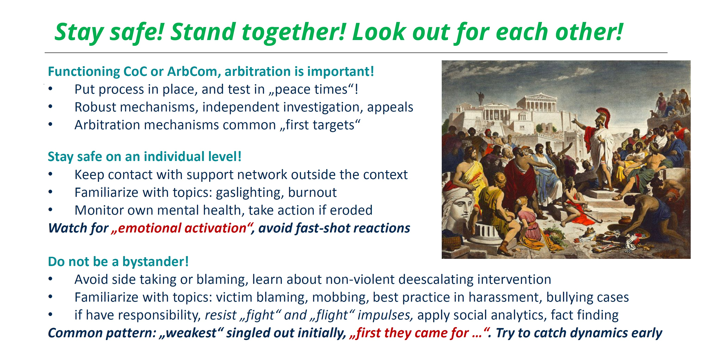

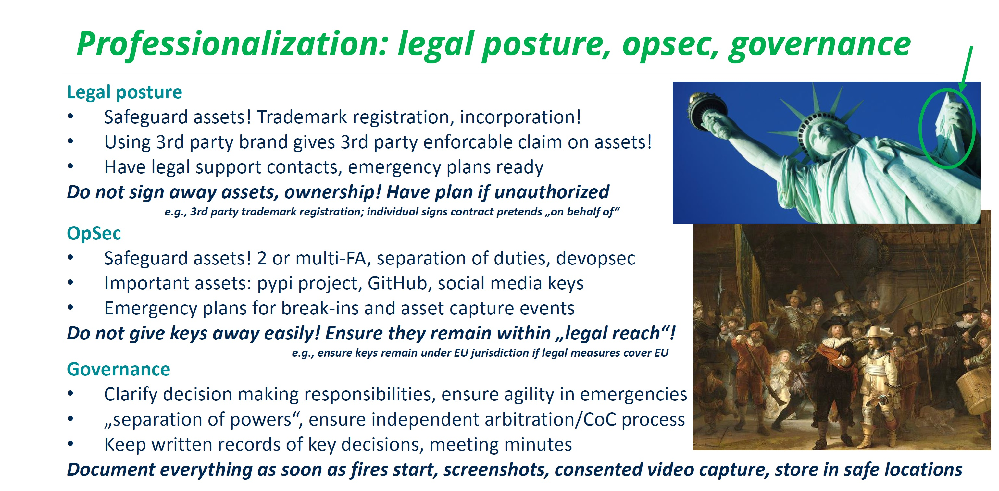

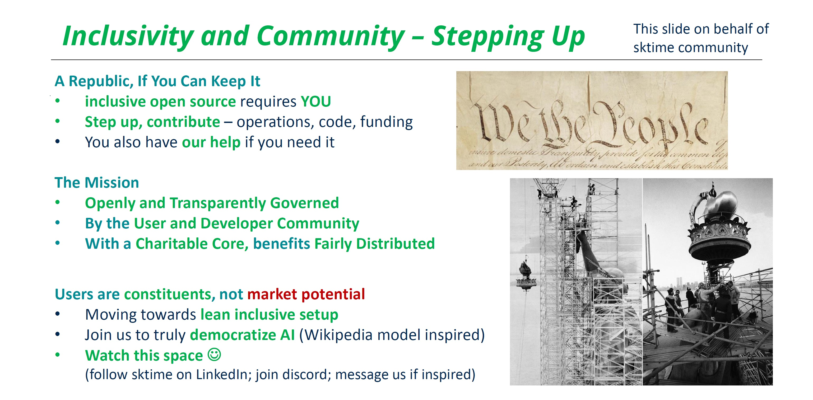

* Reuse is permitted with attribution.
* Branding has been removed in the slides above, compared to the original presentation.
* Images used as part of the presentation are public domain, to the best of our knowledge.
